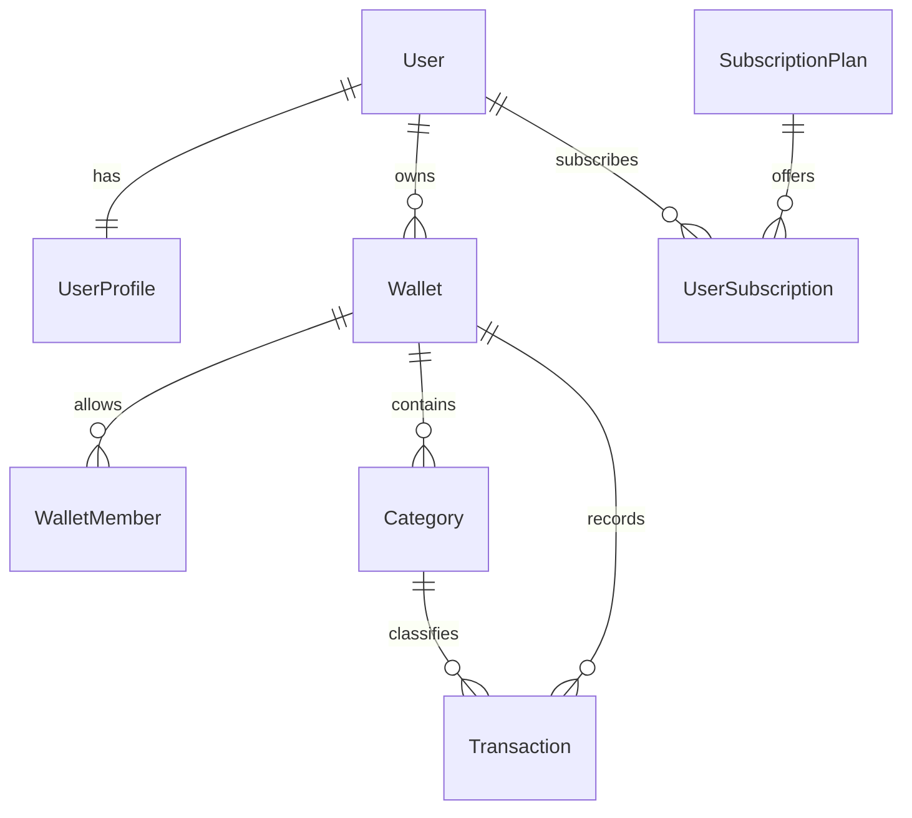
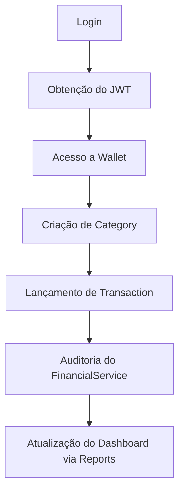

# PW Gerenciamento Financeiro

O **PW Gerenciamento Financeiro** é um sistema de controle financeiro pessoal e compartilhado voltado para uma gestão eficiente de despesas, receitas e transferências. Ele permite organizar saldos em múltiplas carteiras (contas), controlar acessos entre diferentes membros, estruturar metas e fornecer uma visão unificada da saúde financeira do usuário através de dashboards e relatórios analíticos em tempo real.

O backend deste projeto foi projetado para oferecer robustez, integridade de dados contábeis e escalabilidade, seguindo padrões modernos de arquitetura corporativa.

---

## Tecnologias

A aplicação é construída utilizando as seguintes tecnologias e frameworks:

- **Java 21**
- **Spring Boot 4.0.6**
- **Spring Data JPA & Hibernate**
- **Spring Security & OAuth2 Resource Server**
- **MariaDB** (Produção/Desenvolvimento)
- **H2 Database** (Ambiente de Testes)
- **Maven**
- **JWT (JJWT 0.12.6)**
- **Lombok**
- **MapStruct 1.5.5**
- **Swagger / OpenAPI (Springdoc 2.8.9)**
- **JUnit 5 & Mockito**

---

## Arquitetura

O projeto adota uma arquitetura em camadas focada em domínios (_Feature-Based_). Toda lógica e persistência estão bem separadas, respeitando o princípio de responsabilidade única (SOLID). Utilizamos o padrão de DTOs para tráfego externo e MapStruct para tradução ágil entre DTO e Entidade. As respostas HTTP são padronizadas com a classe `ApiResponse` e o tratamento de erros é centralizado no `GlobalExceptionHandler`.

### Árvore Resumida do Projeto

```text
src/main/java
└── com/financeiro/backend
    ├── common
    │   ├── dto         (ApiResponse)
    │   └── exception   (GlobalExceptionHandler)
    ├── config          (SwaggerConfig, etc.)
    ├── security        (SecurityFilterChain, Jwt Filters, PasswordReset)
    └── features
        ├── auth        (User e UserRole)
        ├── profile     (UserProfile)
        ├── wallet      (Wallet e Members)
        ├── category    (Category Income/Expense/Transfer)
        ├── transaction (Transaction core)
        ├── subscription(Plans e UserSubscription)
        ├── reports     (Queries, Projections, Dashboards)
        └── finance     (Engine de processamento de saldos)
```

### Estrutura de Features

- **Auth & Security**: Gerenciamento do fluxo de autenticação e solicitação de troca de senha.
- **User**: Criação, atualização e listagem da conta raiz dos usuários (Register).
- **Profile**: Dados adicionais ao usuário como avatar, nome completo e telefone.
- **Wallet**: Criação e compartilhamento de contas correntes, cartões e limites. Inclui gestão de permissões para membros (`VIEWER`, `EDITOR`, `OWNER`).
- **Category**: Classificação de finanças (Receitas, Despesas, Transferências).
- **Transaction**: Registro de todas as movimentações.
- **Subscription**: Controle de planos (ex: Premium) e gestão de cotas máximas para carteiras e categorias.
- **Reports**: Módulo exclusivamente de leitura otimizado (Dashboards, Extratos com paginação, Fluxo de Caixa). Separado da camada de transação.
- **Finance**: Core contábil interno (não exposto em Controller). Garante a consistência dos saldos das carteiras recalculando e aplicando estornos caso uma transação seja editada ou excluída.

---

## Banco de Dados

Abaixo, a representação estrutural unificada do banco em um diagrama relacional simplificado.



---

## Funcionalidades Implementadas

✅ Cadastro de Usuário (Register)  
✅ Perfil de Usuário  
✅ Reset de Senha (Request/Confirm)  
✅ Gestão de Assinaturas e Planos (Limites de Sistema)  
✅ Carteiras Pessoais e Compartilhadas (Membros)  
✅ Categorias (Receitas, Despesas e Transferências)  
✅ Transações de Receita e Despesa  
✅ Transferências entre Carteiras  
✅ Auditoria Financeira Interna (Engine de Saldos)  
✅ Dashboard Consolidado  
✅ Extratos com Filtros (Specifications)  
✅ Indicadores Analíticos  
✅ Documentação Swagger (OpenAPI)  
✅ Testes Unitários e Cobertura (JUnit + Mockito)

---

## Funcionalidades Futuras

O projeto continua em evolução. As seguintes funcionalidades estão no planejamento e ainda não foram implementadas:

- **Autenticação JWT (Login) e Proteção de Rotas (Spring Security FilterChain)** _(Próxima Sprint)_
- Gamificação e Pontuações
- Metas financeiras e Orçamentos Fixos
- Notificações de Pagamentos e Vencimentos
- Upload de comprovantes (Storage)
- Integração Open Finance / API Bancária
- Aplicativo Mobile

---

## Como Executar

### 1. Clonar o Repositório

```bash
git clone <url-do-repositorio>
cd pw-gerenciamento-financeiro/back-end
```

### 2. Configurar o Banco de Dados

A aplicação utiliza o **MariaDB** por padrão. Crie um banco local:

```sql
CREATE DATABASE financeiro_db;
```

Ajuste as credenciais no arquivo `src/main/resources/application.properties` se necessário:

```properties
spring.datasource.url=jdbc:mariadb://localhost:3306/financeiro_db
spring.datasource.username=root
spring.datasource.password=sua-senha
spring.jpa.hibernate.ddl-auto=update
```

### 3. Executar o Projeto

Via Maven Wrapper (Linux/Mac):

```bash
./mvnw clean install
./mvnw spring-boot:run
```

Via Maven Wrapper (Windows):

```cmd
.\mvnw.cmd clean install
.\mvnw.cmd spring-boot:run
```

A API estará disponível localmente em: `http://localhost:8080/`

---

## Testes

A arquitetura financeira e de relatórios foi extensamente testada para garantir consistência de saldos (Transactions vs FinanceService).

Para rodar a suíte de testes unitários localmente (utilizando banco H2 em memória):

```bash
./mvnw test
```

---

## Documentação da API

1. **Swagger / OpenAPI**
   Assim que o servidor rodar, acesse a interface visual em:  
   👉 [http://localhost:8080/swagger-ui.html](http://localhost:8080/swagger-ui.html)

2. **Guia Completo e Testes Manuais**
   Exemplos reais e validados contra o código:
   - [docs/api/API_TESTS.md](docs/api/API_TESTS.md)

3. **Coleção Postman / Insomnia**
   Há uma coleção completa com 20 requisições prontas e padronizadas para testes diretos. Importe no seu cliente de API favorito:
   - [docs/insomnia/Financeiro_API_Insomnia.json](docs/insomnia/Financeiro_API_Insomnia.json)

---

## Segurança e Autenticação

A arquitetura de segurança atual conta com a estrutura para Reset de Senhas e o esqueleto de configuração do Spring Security e OAuth2.
Atualmente, as rotas aguardam a implementação definitiva do AuthController de Login e dos filtros que validarão a sessão via token JWT (JwtAuthenticationFilter).

### Fluxo Geral do Sistema (Com Auth Futuro)



---

## Roadmap

| Sprint       | Status | Descrição                                                                |
| ------------ | :----: | ------------------------------------------------------------------------ |
| **Sprint 1** |   ✅   | Criação de Estrutura, Arquitetura, Padrão DTO e Exceções                 |
| **Sprint 2** |   ✅   | Domínio Base: Usuários, Perfis, Configurações de Security                |
| **Sprint 3** |   ✅   | Core Financeiro: Transações, Carteiras, Membros, Estornos e Recálculos   |
| **Sprint 4** |   ✅   | CQRS Básico (Leitura): Dashboard, Extratos, Categorização, Indicadores   |
| **Sprint 5** |   ⏳   | Segurança Avançada: Login real (Autenticação JWT), Proteção de Endpoints |
| **Sprint 6** |   ⏳   | Assinaturas, Limites, Testes Finais de Integração                        |
| **Sprint 7** |   ⏳   | Notificações, Gamificação e Metas                                        |

---

## Boas Práticas Adotadas

- **DTO Pattern**: Nunca retornar ou expor Entidades (`@Entity`) diretamente nos Controllers.
- **MapStruct**: Mapeamento seguro de ponta a ponta sem boilerplate ou _Transient Exceptions_.
- **ApiResponse**: Todo output da API tem o mesmo formato unificado (`success`, `message`, `data`).
- **GlobalExceptionHandler**: Tratamento global de falhas capturando `IllegalArgumentException`, `ResourceNotFoundException` e padronizando os erros do `jakarta.validation`.
- **Clean Code & SOLID**: As lógicas financeiras mais pesadas estão segregadas no `FinancialService`, enquanto as leituras foram movidas para `FinancialReportService`, removendo as regras do banco dos Controllers.
